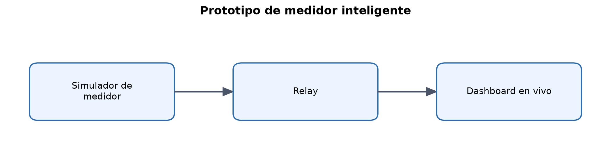

# Smart Meter Prototype

Prototipo de extremo a extremo para generar telegramas compatibles con DSMR,
transportarlos a través de una Raspberry Pi y visualizar el consumo eléctrico
en vivo desde una computadora Windows.



El proyecto prioriza una experiencia de conexión sencilla: el generador escribe
en todos los puertos serie USB que encuentra, el relay de la Raspberry Pi arranca con
`systemd` y el dashboard intenta localizar la Pi a partir de la red Ethernet
que recibe Windows. Los datos se mantienen únicamente en memoria; el prototipo
no incluye una base de datos ni almacenamiento histórico.

## Arquitectura

```text
PC generador (Windows)       Raspberry Pi             PC dashboard (Windows)
meter_simulator.exe  ─USB/serial─> relay.py ─Ethernet/TCP:4000─> dashboard.exe
```

- **Simulador:** genera cada segundo un telegrama con potencia, energía
  acumulada y voltaje, protegido con CRC16/ARC, y lo escribe en todos los
  adaptadores USB a serie disponibles: no puede saber cuál es el cable al
  medidor, y el relay ya descarta los que no traen telegramas.
- **Relay:** detecta el puerto que realmente está transmitiendo telegramas y
  reenvía el flujo a uno o más clientes TCP.
- **Dashboard:** valida el CRC, interpreta los campos DSMR y muestra la energía
  acumulada en Wh, la potencia instantánea, el voltaje, el telegrama completo
  más reciente y una gráfica de consumo.

## Funciones principales

- Telegramas DSMR sintéticos con códigos OBIS y checksum válido.
- Envío a todos los puertos USB y reconexión automática en caliente.
- Relay persistente en Raspberry Pi mediante `systemd`.
- Perfil Ethernet directo administrado por NetworkManager.
- Deducción automática de la dirección de la Pi, con direcciones conocidas y
  enlace local como respaldo.
- Aplicaciones Windows empaquetables como ejecutables independientes.
- Pruebas unitarias y end-to-end sin requerir el hardware físico.

## Requisitos

### Desarrollo y compilación en Windows

- Python 3.10 o posterior.
- Un adaptador USB a serie con su controlador de Windows instalado.
- PowerShell.

### Raspberry Pi

- Raspberry Pi OS con NetworkManager.
- Puerto serie integrado o adaptador USB a serie.
- Puerto Ethernet para el enlace directo con la computadora del dashboard.

El controlador del adaptador serie depende del chipset y no se distribuye en
este repositorio. En particular, algunos adaptadores PL2303 antiguos o
compatibles requieren un controlador específico del fabricante.

## Inicio rápido

### 1. Compilar las aplicaciones de Windows

Desde PowerShell:

```powershell
git clone https://github.com/JanusAdamus/Smart_proto.git
Set-Location Smart_proto
.\build_windows.ps1
```

Los ejecutables se generan en:

```text
dist\meter_simulator.exe
dist\dashboard.exe
```

### 2. Instalar el relay en la Raspberry Pi

Copia el repositorio a la Pi y ejecuta:

```bash
cd Smart_proto
bash install_relay.sh
```

El instalador:

- instala las dependencias del sistema;
- configura el perfil Ethernet `smartmeter-direct`;
- copia el relay a `/opt/smartmeter`;
- habilita `relay.service` para cada arranque;
- agrega el usuario del servicio al grupo `dialout`.

Para comprobarlo:

```bash
systemctl status relay --no-pager
journalctl -u relay -f
```

### 3. Conectar y ejecutar

1. Conecta el adaptador serie entre la computadora generadora y la Pi.
2. Conecta por Ethernet la Pi y la computadora que mostrará el dashboard.
3. Deja IPv4 de esa interfaz de Windows en asignación automática.
4. Ejecuta `meter_simulator.exe` en la primera computadora.
5. Enciende la Pi. El relay se inicia por sí solo.
6. Ejecuta `dashboard.exe` en la segunda computadora.

Las ventanas muestran el puerto seleccionado, el estado de conexión y los
telegramas enviados o recibidos. No es necesario escribir una dirección IP en
las aplicaciones.

## Configuración avanzada

La autodetección es el comportamiento predeterminado. Para diagnóstico o
hardware no estándar se pueden usar estas variables antes de iniciar el
componente correspondiente:

```text
SMARTMETER_PORT
SMARTMETER_ETHERNET_INTERFACE
SMARTMETER_ETHERNET_ADDRESS
SMARTMETER_LINK_LOCAL_ADDRESS
```

Por ejemplo, para instalar la Pi usando otra interfaz:

```bash
SMARTMETER_ETHERNET_INTERFACE=enx1234 bash install_relay.sh
```

## Pruebas

```powershell
python -m pip install -r requirements.txt
python -m pytest -q
```

Las pruebas cubren generación y validación de telegramas, fragmentación del
flujo, detección serie, retransmisión TCP, reconexión y selección de rutas de
red.

## Alcance y limitaciones

Este repositorio es un prototipo técnico, no un producto certificado para
medición o facturación. Los valores del simulador son sintéticos. La conexión
directa depende de que Windows mantenga IPv4 automático en el adaptador
Ethernet y de que el controlador del adaptador serie sea compatible. El
tráfico TCP no está cifrado ni autenticado y debe utilizarse en una red local
controlada.

## Estructura del proyecto

| Archivo | Función |
| --- | --- |
| `meter_simulator.py` | Generador y escritor serie con interfaz gráfica |
| `relay.py` | Relay serie a TCP para Raspberry Pi |
| `dashboard.py` | Dashboard de consumo en vivo |
| `dsmr.py` | Generación, CRC y parser de telegramas |
| `serial_link.py` | Detección y recuperación de puertos serie |
| `discovery.py` | Anuncio y utilidades de descubrimiento de red |
| `install_relay.sh` | Instalación y red persistente de la Pi |
| `build_windows.ps1` | Compilación de los ejecutables Windows |

